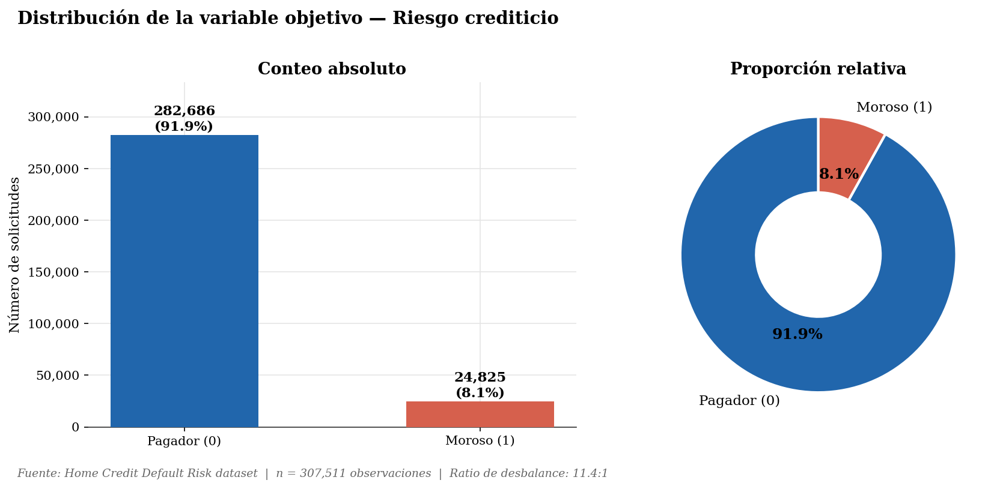
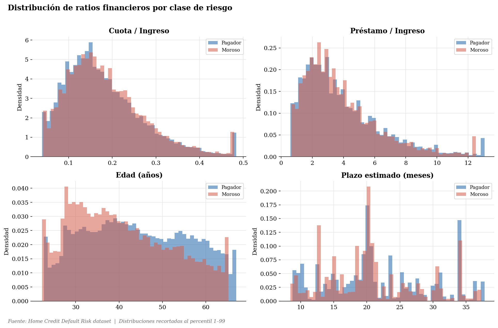
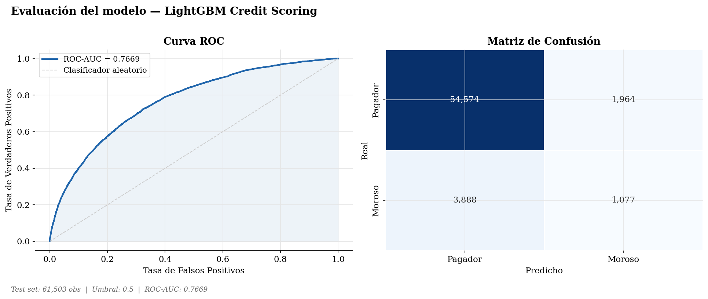
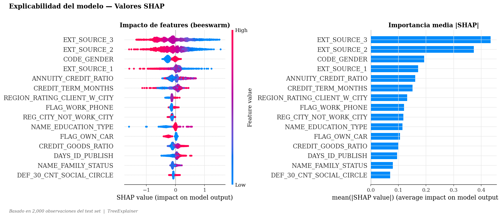

# Credit scoring MLOps
### Modelamiento predictivo de riesgo crediticio y explicabilidad financiera mediante algoritmos de ensamble (LightGBM) y valores SHAP en entornos de clases desbalanceadas

<p align="center">
  
  
  
  
  
  
</p>

<p align="center">
  
  
  
</p>

---

## Resumen del proyecto

Sistema completo de **scoring crediticio** que combina técnicas avanzadas de Machine Learning con una arquitectura MLOps de nivel productivo. El modelo predice la probabilidad de mora de un solicitante de crédito, proporcionando no solo una decisión sino también una **explicación transparente** de los factores que determinaron esa decisión.

> **Dataset:** Home Credit Default Risk (307,511 solicitudes de crédito)
> **Problema:** Clasificación binaria con clases altamente desbalanceadas (91.9% pagadores vs 8.1% morosos)

---

## Resultados del modelo

| Métrica | Valor |
|---------|-------|
| **ROC-AUC Test** | 0.7669 |
| **ROC-AUC CV (5-fold)** | 0.9299 ± 0.0015 |
| **Accuracy** | 91% |
| **Precision (Morosos)** | 36% |
| **Recall (Morosos)** | 22% |

> El alto CV medio (0.9299) con baja varianza (±0.0015) confirma la estabilidad y generalización del modelo.

---

## Arquitectura MLOps

```
┌─────────────────────────────────────────────────────────────┐
│              PIPELINE AUTOMATIZADO (GitHub Actions)          │
│                  Reentrenamiento diario 2:00 AM              │
├──────────────┬──────────────┬──────────────┬────────────────┤
│   Ingesta    │  Ingeniería  │ Entrenamiento│   Despliegue   │
│              │  de features │              │                │
│ PostgreSQL   │  4 Ratios    │   SMOTE      │   FastAPI      │
│ CSV / API    │  financieros │  LightGBM    │   Docker       │
│              │  SHAP values │  MLflow      │   REST API     │
└──────────────┴──────────────┴──────────────┴────────────────┘
```

---

## Metodología

### 1. Tratamiento del desbalance de clases
Se utilizó **SMOTE** (synthetic minority oversampling technique) con un ratio de 30% para generar muestras sintéticas de la clase minoritaria (morosos), evitando el sesgo del modelo hacia la clase mayoritaria.

```python
smote = SMOTE(sampling_strategy=0.3, k_neighbors=5, random_state=42)
X_bal, y_bal = smote.fit_resample(X_train, y_train)
# Resultado: 293,992 filas balanceadas
```

### 2. Feature engineering — Ratios financieros
Se construyeron variables derivadas con interpretación económica directa:

| Feature | Fórmula | Interpretación |
|---------|---------|----------------|
| `PAYMENT_RATE` | Cuota / Ingreso anual | Carga del servicio de deuda |
| `CREDIT_INCOME_RATIO` | Préstamo / Ingreso anual | Nivel de apalancamiento |
| `CREDIT_GOODS_RATIO` | Préstamo / Valor del bien | Loan-to-Value ratio |
| `ANNUITY_CREDIT_RATIO` | Cuota / Préstamo total | Proxy inverso del plazo |
| `AGE_YEARS` | \|DAYS_BIRTH\| / 365 | Edad del solicitante |
| `CREDIT_TERM_MONTHS` | Préstamo / Cuota | Plazo estimado |

### 3. Modelo — LightGBM
Se eligió LightGBM por su eficiencia en datasets grandes, manejo nativo de valores faltantes y excelente rendimiento en tareas de clasificación tabular.

```python
params = {
    'n_estimators': 1000,
    'learning_rate': 0.05,
    'num_leaves': 63,
    'subsample': 0.8,
    'colsample_bytree': 0.8,
    'reg_alpha': 0.1,
    'reg_lambda': 0.1,
    'class_weight': 'balanced'
}
```

### 4. Explicabilidad — Valores SHAP
Se implementó **TreeExplainer** de SHAP para proporcionar explicaciones locales y globales del modelo, cumpliendo con los principios de IA explicable (XAI) requeridos en el sector financiero.

---

## Stack Tecnológico

| Capa | Tecnología | Propósito |
|------|-----------|-----------|
| **ML Core** | LightGBM 4.3 | Modelo de clasificación |
| **Desbalance** | imbalanced-learn (SMOTE) | Oversampling |
| **Explicabilidad** | SHAP 0.45 | Valores SHAP por cliente |
| **Experiment Tracking** | MLflow 2.13 | Versioning de modelos |
| **API** | FastAPI + Uvicorn | Servicio REST de predicciones |
| **Validación** | Pydantic v2 | Validación de inputs |
| **Contenedor** | Docker | Despliegue reproducible |
| **CI/CD** | GitHub Actions | Reentrenamiento automático |

---

## Estructura del Proyecto

```
credit-scoring-mlops/
├── data/
│   └── raw/                    ← application_train.csv (via Git LFS)
├── notebooks/
│   ├── 01_exploracion.ipynb    ← EDA y análisis de desbalance
│   ├── 02_features.ipynb       ← Feature engineering
│   └── 03_modelo_lgbm.ipynb    ← Entrenamiento + SHAP
├── model/
│   ├── artifacts/              ← lgbm_model.joblib, preprocessor.joblib
│   └── reports/                ← Curva ROC, gráficas SHAP
├── app/
│   ├── main.py                 ← Servidor FastAPI
│   ├── predictor.py            ← Lógica de predicción
│   └── schemas.py              ← Validación Pydantic
├── pipelines/
│   └── train_pipeline.py       ← Pipeline automatizado completo
├── docker/
│   ├── Dockerfile
│   └── docker-compose.yml
├── .github/workflows/
│   └── retrain.yml             ← CI/CD reentrenamiento diario
├── config.yaml                 ← Configuración centralizada
└── requirements.txt
```

---

## Inicio Rápido

### Opción 1 — Docker
```bash
# Construir imagen
docker build -t credit-scoring-api -f docker/Dockerfile .

# Lanzar contenedor
docker run -d --name credit_scoring_api -p 8000:8000 credit-scoring-api

# Abrir documentación interactiva
# http://127.0.0.1:8000/docs
```

### Opción 2 — Local
```bash
# Clonar repositorio
git clone https://github.com/Jairorsg/credit-scoring-mlops.git
cd credit-scoring-mlops

# Crear entorno virtual
python -m venv venv
source venv/bin/activate  # Linux/Mac
.\venv\Scripts\activate   # Windows

# Instalar dependencias
pip install -r requirements.txt

# Reentrenar modelo
python pipelines/train_pipeline.py

# Lanzar API
uvicorn app.main:app --reload --port 8000
```

---

## API Endpoints

### `POST /predict` — Predicción de riesgo crediticio

**Request:**
```json
{
  "AMT_INCOME_TOTAL": 135000.0,
  "AMT_CREDIT": 450000.0,
  "AMT_ANNUITY": 22500.0,
  "AMT_GOODS_PRICE": 400000.0,
  "DAYS_BIRTH": -12000,
  "DAYS_EMPLOYED": -2000,
  "CNT_FAM_MEMBERS": 2.0,
  "NAME_CONTRACT_TYPE": "Cash loans",
  "CODE_GENDER": "F"
}
```

**Response:**
```json
{
  "decision": "APROBADO",
  "probabilidad": 0.3303,
  "score": 669,
  "nivel_riesgo": "ALTO",
  "umbral_usado": 0.5,
  "modelo_version": "lgbm_v1_auc0.7669"
}
```

### `GET /health` — Estado del modelo
```json
{
  "status": "ok",
  "modelo_version": "lgbm_v1_auc0.7669",
  "roc_auc_test": 0.7669,
  "roc_auc_cv_mean": 0.9299
}
```

---

## Pipeline MLOps automatizado

El workflow de GitHub Actions se ejecuta automáticamente **todos los días a las 2:00 AM UTC**:

```
Checkout código (con Git LFS)
        ↓
Instalar dependencias
        ↓
Verificar datos frescos
        ↓
Reentrenar LightGBM + SMOTE
        ↓
Verificar ROC-AUC ≥ 0.70
        ↓
Guardar artefactos del modelo
        ↓
Registrar en MLflow
```

---

## Visualizaciones

El proyecto genera automáticamente 4 reportes en `model/reports/`:

### 1. Desbalance de clases


### 2. Ratios por clase


### 3. Curva ROC y matriz de confusión


### 4. Explicabilidad del modelo (SHAP)


---

## Autor

**Jairo Roberto Sequeiros Gallegos** — Estudiante de ingenieria economica de la Universidad Nacional del Altiplano Puno.

- Proyecto académico: *"Modelamiento predictivo de riesgo crediticio y explicabilidad financiera mediante algoritmos de ensamble (LightGBM) y valores SHAP en entornos de clases desbalanceadas"*
- Especialización: Data Scientist — Financial Risk & MLOps

---

## Licencia

Este proyecto es de uso académico. Los datos utilizados provienen del dataset público [Home Credit Default Risk](https://www.kaggle.com/c/home-credit-default-risk) de Kaggle.